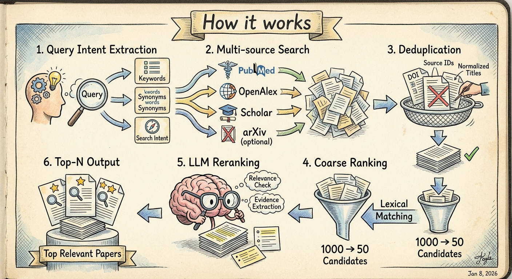

# PaperCLI

A command-line tool for searching academic papers using LLM-powered query understanding and ranking.

## Features

- **Multi-source search**: PubMed, OpenAlex, Google Scholar (via SerpAPI), arXiv
- **LLM-powered query understanding**: Automatically extracts intent, expands synonyms, and translates queries
- **Platform-specific query generation**: Generate optimized search queries for PubMed, Google Scholar, or Web of Science
- **PDF text extraction**: Extract text from PDFs using Doc2X API with page-level JSONL output
- **DOI-based PDF download**: Fetch open-access PDFs via Unpaywall and PubMed Central (PMC)
- **Article highlight slides**: Generate visual summary slides from article text using Gemini (multiple styles)
- **Smart ranking**: Coarse lexical ranking followed by LLM-based relevance scoring
- **Evidence extraction**: Returns the most relevant quote from each paper
- **Configurable models**: Use different LLM models for intent extraction vs evaluation
- **Caching**: SQLite-based caching to avoid redundant API calls

## Installation

Install PaperCLI from Github.

```bash
pip install git+https://github.com/xuzhougeng/paper.git
```

## Configuration

Set the following environment variables:

```bash
# Required: LLM API key (OpenAI or compatible)
export LLM_API_KEY="sk-..."

# Optional: Model configuration (defaults shown)
export PAPERCLI_INTENT_MODEL="gpt-4o-mini"  # For query rewriting
export PAPERCLI_EVAL_MODEL="gpt-4o"          # For paper evaluation

# Optional: Required for Google Scholar search
export SERPAPI_API_KEY="your-serpapi-key"

# Optional: Required for PDF extraction (paper extract command)
export DOC2X_API_KEY="sk-..."  # Get from https://open.noedgeai.com

# Optional: Required for PDF download by DOI (paper fetch-pdf command)
export UNPAYWALL_EMAIL="your@email.com"  # Required for Unpaywall API
export NCBI_API_KEY="your-ncbi-key"       # Optional, improves PMC rate limits

# Optional: Required for slide generation (paper slide command)
export GEMINI_API_KEY="your-gemini-key"  # Get from Google AI Studio
```

建议: PAPERCLI_INTENT_MODEL建议模型不能弱于gpt-4o, 最好是gpt-5等具有推理能力模型，这样子可以生成更好的检索词。

注: `paper find`需要配置OpenAI的API Key, `paper slide`命令需要用到谷歌的AI Studio的API Key.
如果无法使用官方API，可以使用第三方中转商，例如我用的是[CloseAI](https://referer.shadowai.xyz/r/12432)，配置方法如下:

```bash
export LLM_BASE_URL="https://api.openai-proxy.org/v1"  # for OpenAI
export GEMINI_BASE_URL="https://api.openai-proxy.org/google/v1beta"  # for Google
```


Or create a `~/.papercli.toml` configuration file:

```toml
[llm]
api_key = "sk-..."  # Required: OpenAI or compatible API key
base_url = "https://api.openai.com/v1"
intent_model = "gpt-4o-mini"  # Default: gpt-4o-mini (for query rewriting)
eval_model = "gpt-4o"          # Default: gpt-4o (for paper evaluation)

[cache]
path = "~/.cache/papercli.sqlite"
enabled = true

[doc2x]
api_key = "sk-..."  # Optional: for PDF extraction
# base_url = "https://v2.doc2x.noedgeai.com"  # Default

[unpaywall]
email = "your@email.com"  # Required for PDF download by DOI

[api_keys]
ncbi_api_key = "..."  # Optional: improves PMC rate limits

[gemini]
api_key = "..."  # Optional: for slide generation
# base_url = "https://api.openai-proxy.org/google/v1beta"  # Default proxy
# text_model = "gemini-3-flash-preview"  # For highlight extraction
# image_model = "gemini-3-pro-image-preview"  # For slide image generation
```

## Usage

### Basic search

```bash
paper find "CRISPR gene editing for cancer therapy"
```

### With options

```bash
# Return top 10 results in JSON format
paper find "machine learning for drug discovery" --top-n 10 --format json

# Search only PubMed and OpenAlex
paper find "protein folding prediction" --sources pubmed,openalex

# Use specific models
paper find "neural networks" --intent-model gpt-4o-mini --eval-model gpt-4o

# Show all retrieved papers (skip LLM ranking)
paper find "CRISPR therapy" --show-all

# Verbose output
paper find "single cell RNA sequencing" --verbose
```

### Output formats

- `table` (default): Rich formatted table
- `json`: JSON output for programmatic use
- `md`: Markdown format

#### How it works



1. **Query Intent Extraction**: LLM analyzes your query to extract keywords, synonyms, and search intent
2. **Multi-source Search**: Searches PubMed, OpenAlex, Scholar, and optionally arXiv in parallel
3. **Deduplication**: Removes duplicate papers using DOI, source IDs, and normalized titles
4. **Coarse Ranking**: Uses lexical matching to reduce candidates to a manageable number
5. **LLM Reranking**: Each candidate is evaluated by LLM for relevance, with evidence extraction
6. **Top-N Output**: Returns the most relevant papers with supporting evidence


### Generate platform-specific search queries

Use `gen-query` to generate an optimized search query for a specific database platform without actually searching. This is useful when you want to run the search manually or refine the query.

```bash
# Generate a PubMed search query (default)
paper gen-query "CRISPR gene editing for cancer therapy"

# Generate a Google Scholar search query
paper gen-query "single cell RNA velocity" --platform scholar

# Generate a Web of Science search query
paper gen-query "machine learning drug discovery" --platform wos

# Output as Markdown (easy to copy to notes)
paper gen-query "protein structure prediction" --platform pubmed --format md

# Output as JSON (for programmatic use)
paper gen-query "neural networks" --platform scholar --format json
```

Supported platforms:
- `pubmed` (default): PubMed/MEDLINE - uses Boolean operators, field tags like `[Title/Abstract]`, `[MeSH Terms]`
- `scholar`: Google Scholar - optimized for shorter, keyword-focused queries
- `wos`: Web of Science - uses `TS=`, `TI=` field tags and `NEAR/x` proximity operators

Platform aliases: `google_scholar` → `scholar`, `web_of_science` / `world_of_knowledge` → `wos`

### Extract text from PDF[Experimental Feature]

Use `extract` to parse a PDF file using [Doc2X](https://doc2x.noedgeai.com/) and output page-level JSONL. Each line contains one page with extracted text.

```bash
# Extract to stdout (pipe to file or other tools)
paper extract paper.pdf

# Extract to a file
paper extract paper.pdf --out result.jsonl

# Download images to local directory (replaces CDN URLs with local paths)
paper extract paper.pdf --image-dir ./images --out result.jsonl

# Include raw page data (for debugging or further processing)
paper extract paper.pdf --include-raw --out result.jsonl

# With verbose output
paper extract paper.pdf --verbose
```

Output JSONL format (one JSON object per line):
```json
{"doc2x_uid": "...", "source_path": "/path/to/paper.pdf", "page_index": 0, "page_no": 1, "text": "..."}
{"doc2x_uid": "...", "source_path": "/path/to/paper.pdf", "page_index": 1, "page_no": 2, "text": "..."}
```

Options:
- `--out PATH`: Write output to file instead of stdout
- `--image-dir PATH`: Download images to this directory and replace CDN URLs with local paths
- `--poll-interval FLOAT`: Seconds between status polls (default: 2.0)
- `--timeout FLOAT`: Maximum wait time in seconds (default: 900)
- `--include-raw/--no-include-raw`: Include raw page data in output
- `--verbose/-V`: Show detailed progress
- `--quiet/-q`: Suppress progress output

### Structure `result.jsonl` for database ingestion

`paper structure` performs a **second-pass parse** on the page-level JSONL produced by `paper extract`, and outputs a single structured JSON object with fields like title/abstract/methods/results and main vs supplementary figures/tables.

```bash
# Turn result.jsonl into a single structured JSON document
paper structure result.jsonl --out structured.json

# Or output a Markdown report for easier reading
paper structure result.jsonl --out structured.md
# (equivalent) paper structure result.jsonl --format md --out structured.md
```

### Download PDF by DOI

Use `fetch-pdf` to download open-access PDFs using a DOI. The command first queries [Unpaywall](https://unpaywall.org/) for direct PDF links, then falls back to [PubMed Central (PMC)](https://pmc.ncbi.nlm.nih.gov/) if needed.

```bash
# Download PDF to current directory
paper fetch-pdf 10.1038/nature12373

# Specify output directory
paper fetch-pdf "10.1038/s41586-023-06291-2" --out-dir ./pdfs

# Custom filename
paper fetch-pdf 10.1038/nature12373 --out-dir ./pdfs --filename paper.pdf

# Only show PDF URL without downloading
paper fetch-pdf 10.1000/xyz123 --no-download

# Output metadata as JSON
paper fetch-pdf 10.1038/nature12373 --no-download --format json

# Skip Unpaywall, use PMC only
paper fetch-pdf 10.1038/nature12373 --skip-unpaywall

# Skip PMC fallback, use Unpaywall only
paper fetch-pdf 10.1038/nature12373 --skip-pmc
```

Options:
- `--out-dir PATH`: Directory to save PDF (default: current directory)
- `--filename NAME`: Output filename (default: `{doi_safe}.pdf`)
- `--no-download`: Only show PDF URL, don't download
- `--skip-unpaywall`: Skip Unpaywall lookup (use PMC only)
- `--skip-pmc`: Skip PMC fallback (use Unpaywall only)
- `--format`: Output format for metadata: `table` (default) or `json`
- `--verbose/-V`: Show detailed progress
- `--quiet/-q`: Suppress progress output

**Note**: Requires `UNPAYWALL_EMAIL` environment variable or `[unpaywall] email` in config file.

### Generate article highlight slides

Use `slide` to generate a visual summary slide from article text. The command extracts key highlights using Gemini and generates a styled single-page PNG image.

```bash
# Generate a hand-drawn style slide from a text file
paper slide --in article.txt --style handdrawn --out slide.png

# Use minimal style with custom output
paper slide --in paper.txt --style minimal --out summary.png

# Pipe text from stdin
cat article.txt | paper slide --style academic

# Customize number of bullet points and image size
paper slide --in text.txt --bullets 3 --image-size 2K --style dark

# Show extracted highlights in terminal
paper slide --in article.txt --style colorful --show-highlights
```

Supported styles:
- `handdrawn`: Hand-drawn sketch style with marker strokes (default)
- `minimal`: Ultra-minimalist clean design
- `academic`: Professional academic poster style
- `dark`: Dark futuristic tech theme
- `colorful`: Vibrant and energetic design

Options:
- `--in PATH`: Input text file (reads from stdin if not provided)
- `--out PATH`: Output PNG file path (default: `slide.png`)
- `--style STYLE`: Visual style preset
- `--bullets N`: Number of bullet points 1-8 (default: 5)
- `--aspect-ratio`: Image aspect ratio: `16:9`, `4:3`, `1:1` (default: `16:9`)
- `--image-size`: Image size: `1K`, `2K`, `4K` (default: `1K`)
- `--show-highlights`: Print extracted highlights to terminal
- `--verbose/-V`: Show detailed progress
- `--quiet/-q`: Suppress progress output

**Note**: Requires `GEMINI_API_KEY` environment variable or `[gemini] api_key` in config file.

## License

MIT

